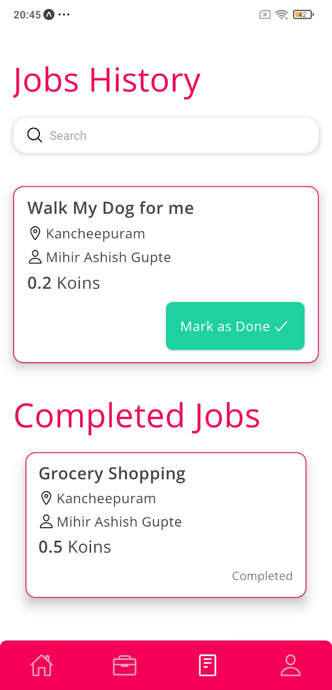

<h2>HandMeDown UI</h2>

HandMeDown UI is a cross-platform mobile application to post and find odd jobs. This is a test application and nothing is live as of now including the server.
 
Current working features-
<ol>
    <li>Sign Up/In</li>
    <li>Logout</li>
    <li>Post a job</li>
    <li>Find a job</li>
    <li>Accept a job</li>
    <li>Delete a job</li>
</ol>

 
<h4>How to run-</h4>
<ol>
    <li>git clone</li>
    <li>npm i</li>
    <li>expo start</li>
</ol>

<h6>Note- You will also need the backend to be running to make it working</h6>

<h4>Screenshots-</h4>

<ol>
    <li>
        <h4>Splash Screen</h4>
        
    </li>
    <li>
        <h4>Sign In Screen</h4>
        
    </li>
    <li>
        <h4>Sign In Form Filled</h4>
        
    </li>
    <li>
        <h4>Sign Up Screen</h4>
        
    </li>
    <li>
        <h4>Homepage</h4>
        
    </li>
    <li>
        <h4>HomePage with active job</h4>
        
    </li>
    <li>
        <h4>Post a job form</h4>
        
    </li>
    <li>
        <h4>Find Odd Jobs</h4>
        
    </li>
    <li>
        <h4>Odd Job details Screen</h4>
        
    </li>
    <li>
        <h4>Odd Job details screen</h4>
        
    </li>
    <li>
        <h4>Job History</h4>
        
    </li>
    <li>
        <h4>Job Mark as complete</h4>
        
    </li>
    <li>
        <h4>Profile </h4>
        
    </li>
    <li>
        <h4>Logout</h4>
        
    </li>
</ol>